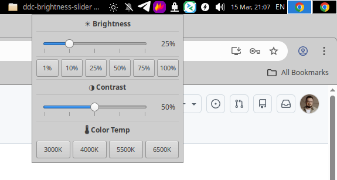

# xfce4-ddc-brightness-slider

GTK3 system tray applet for XFCE4 that controls external monitor brightness via [DDC/CI](https://en.wikipedia.org/wiki/Display_Data_Channel) protocol.



## Features

- **Tray icon** left click opens a brightness popup right next to the panel
- **Slider** with 150 ms debounce, smooth dragging without spamming `ddccontrol`
- **Quick presets** 1 %, 10 %, 25 %, 50 %, 75 %, 100 % buttons below the slider
- **Auto-detection** of the monitor I2C bus during installation
- **Standalone mode** floating window as an alternative to the tray
- **Lightweight** single Python file, no build step, no pip packages

## Requirements

- Linux with an external monitor that supports DDC/CI
- XFCE4 (or any DE with a system tray / status notifier area)
- Python 3.8+
- GTK 3

## Installation

### Via script

```bash
git clone https://github.com/krsnv/xfce4-ddc-brightness-slider.git
cd ddc-brightness-slider
chmod +x install.sh
./install.sh
```

The installer will:

1. Install system packages (`ddccontrol`, `python3-gi`, `gir1.2-gtk-3.0`)
2. Create the `i2c` group and udev rule for non-root access to `/dev/i2c-*`
3. Add your user to the `i2c` group
4. Copy the script to `/usr/local/bin/`
5. Set up autostart for your XFCE session
6. Probe all I2C buses to find your monitor

### Manual installation

```bash
sudo apt install ddccontrol python3-gi gir1.2-gtk-3.0
sudo modprobe i2c-dev
echo "i2c-dev" | sudo tee /etc/modules-load.d/i2c-dev.conf

sudo groupadd -f i2c
sudo usermod -aG i2c $USER
echo 'KERNEL=="i2c-[0-9]*", GROUP="i2c", MODE="0660"' | sudo tee /etc/udev/rules.d/99-i2c.rules
sudo udevadm control --reload-rules && sudo udevadm trigger

sudo cp ddc-brightness-slider.py /usr/local/bin/
sudo chmod +x /usr/local/bin/ddc-brightness-slider.py
```

## Troubleshooting

**"Permission denied" on `/dev/i2c-*`**

```bash
# Make sure the udev rule exists
cat /etc/udev/rules.d/99-i2c.rules
# Should contain: KERNEL=="i2c-[0-9]*", GROUP="i2c", MODE="0660"

# Make sure you're in the i2c group
groups | grep i2c

# If not, add yourself and relog
sudo usermod -aG i2c $USER
```

**ddccontrol can't find the monitor**

```bash
# Make sure i2c-dev is loaded
sudo modprobe i2c-dev

# Scan for monitors
sudo ddccontrol -p

# Try each bus manually
for dev in /dev/i2c-*; do
    echo "--- $dev ---"
    ddccontrol -r 0x10 "dev:$dev" 2>/dev/null | grep -E '\+/|current'
done
```

## Uninstall

```bash
sudo rm /usr/local/bin/ddc-brightness-slider.py
rm ~/.config/autostart/ddc-brightness-slider.desktop
rm ~/.local/share/applications/ddc-brightness-slider.desktop
```

## TODO

- [ ] Add: multi monitor support
- [ ] Add: configuration file for custom use-cases


## Contributing

Contributions are welcome. If you would like to improve the plugin, please fork the repository, create a separate branch for your changes, and submit a pull request with a clear description of what was modified and why.

For bug reports, feature requests, or any other problems you notice, please open an Issue in this repository. Describe the problem in detail, including your system configuration, steps to reproduce (if applicable), and any relevant logs or screenshots.

All detected problems should be reported as Issues so they can be tracked and addressed properly.
